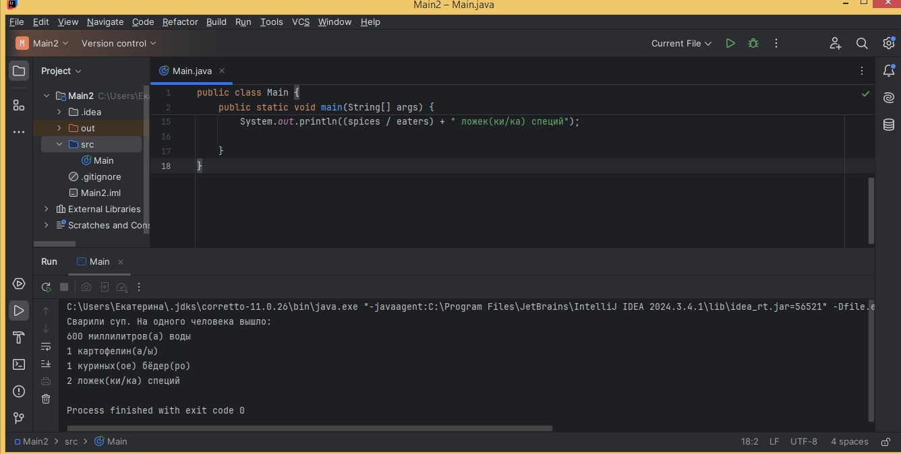

# Описание 
Если в результате деления общего количества ингредиента на количество людей получается дробное число, то программа не отображает его дробную часть. По условиям задачи: на выходе программа указывает без округлений, какое точное количество каждого ингредиента пришлось на одну порцию еды.
При делении куринных бедер на количество человек не отображается точное число. 

# Локация дефекта
https://github.com/EkaterinaAsanova/Netology_Java_HW_1/blob/6ef27343fa7db5d166219a896a348c463affa0e9/src/Main.java#L14

# Шаги воспроизведения
1. Открыть [код программы](https://github.com/EkaterinaAsanova/Netology_Java_HW_1/blob/main/src/Main.java) в IDEA
2. Проверить, чтобы значение переменной eaters было равно 5
3. Проверить, чтобы значение переменной chicken было равно 6
4. Запустить программу
5. Посмотреть на вывод в консоли
   
   *Ожидаемый результат:* 1.2 куриных(ое) бёдер(ро)

   *Фактический результат:* 1 куриных(ое) бёдер(ро)

   # Скриншот 

   

   # Окружение 
   * **Операционная система:** Windows 8.1 Корпоративная
   * **IDE:** IntelliJ IDEA 2024.3.4.1
   *  **Java:** OpenJDK11